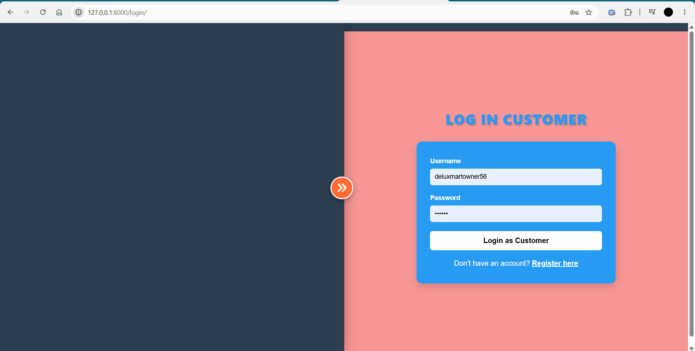
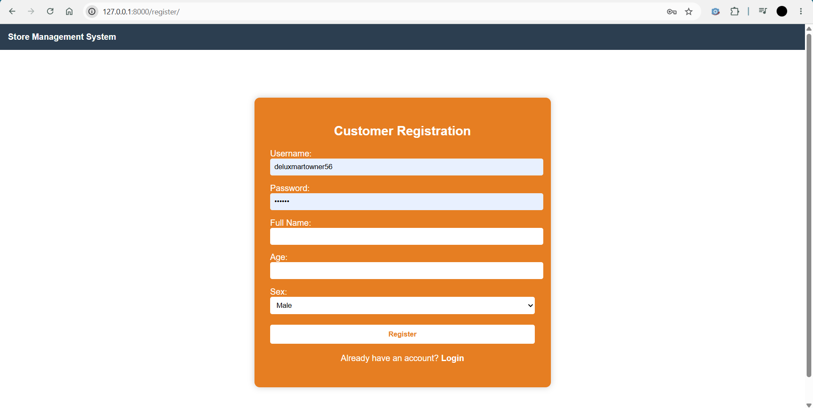
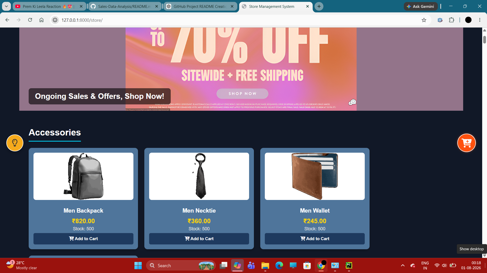
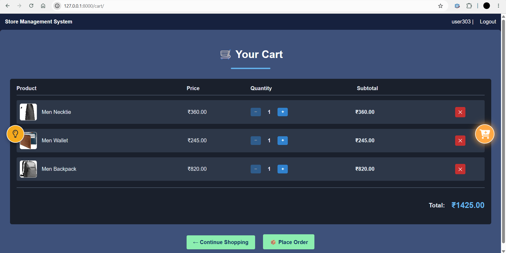
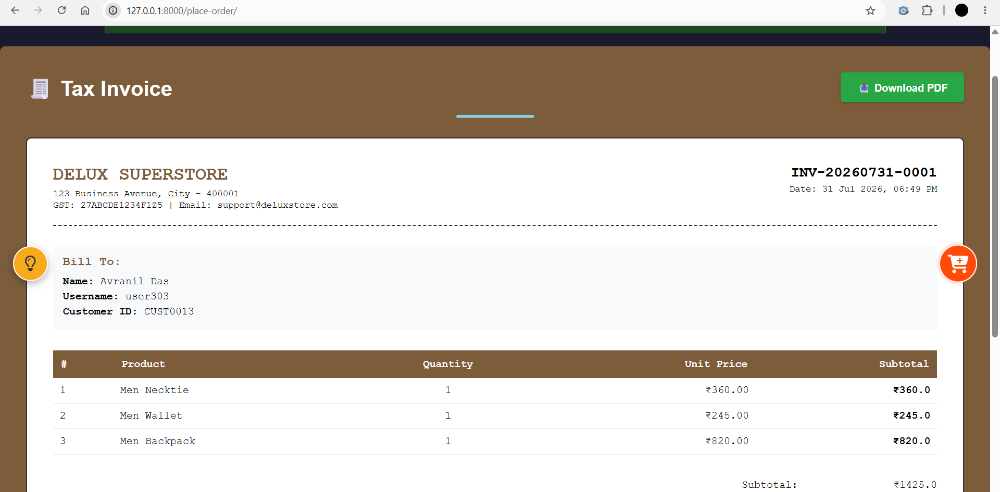
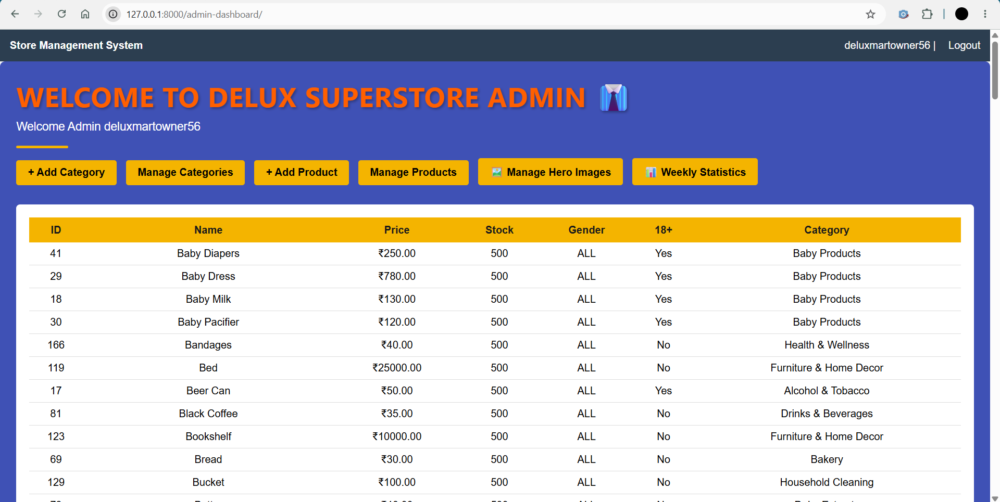

# DELUX SUPER MART - Online Supermarket Management System


*Full-featured supermarket management and online shopping platform*

## Project Overview

Developed a supermarket e-commerce platform with customer and admin interfaces using:

* **Django** for backend development and business logic
* **MySQL** for product, customer, and sales data management
* **HTML, CSS, and JavaScript** for frontend design and interactivity
* **Python** for order processing, inventory management, and invoice generation

## Technical Implementation

### System Workflow

1. **User Authentication**:

   * Customer registration using username and password
   * Shared login portal for customers and administrators
   * Role-based dashboard redirection

2. **Shopping System**:

   * Products organized into categories
   * Age-based and gender-based product filtering
   * Dynamic shopping cart with quantity controls
   * Real-time order total calculation

3. **Inventory & Order Processing**:

   * Automatic stock deduction after purchase
   * Invoice generation for completed orders
   * Admin-controlled inventory management
   * Weekly sales reporting and analytics

### Key Scripts

| File                      | Purpose                                                                    |
| ------------------------- | -------------------------------------------------------------------------- |
| `models.py`               | Database models for products, customers, categories, orders, and inventory |
| `views.py`                | Shopping, cart, authentication, order, and dashboard logic                 |
| `urls.py`                 | Application routing and URL management                                     |
| `utils.py`                | Invoice generation and helper functions                                    |
| `super_market_backup.sql` | Database backup and sample data                                            |

## Core Features

| Feature                   | Functionality                                         |
| ------------------------- | ----------------------------------------------------- |
| User Registration & Login | Secure customer and administrator authentication      |
| Product Catalog           | Category-based product organization                   |
| Smart Product Filtering   | Age and gender-based product visibility               |
| Shopping Cart             | Add, remove, and modify product quantities            |
| Invoice Generation        | Downloadable invoice after successful order placement |
| Theme Switching           | Toggle between light and dark mode                    |
| Inventory Management      | Automatic stock updates after purchases               |
| Hero Image Management     | Admin-controlled homepage slideshow                   |
| Sales Analytics           | Weekly reports and performance insights               |


## Platform Screenshots

### Login Page


### Registration Page


### Home Page


### Shopping Window


### Cart Page


### Invoice Page


### Admin Dashboard



| Page              | Description                              |
| ----------------- | ---------------------------------------- |
| Login Page        | Customer and Admin authentication portal |
| Registration Page | New customer account creation            |
| Shopping Window   | Product browsing and filtering           |
| Cart Page         | Quantity management and checkout         |
| Invoice Page      | Order confirmation and invoice download  |
| Admin Dashboard   | Inventory management and analytics       |

## Key Findings

1. **Smart Inventory Control**:

   * Product stock automatically updates after every successful purchase
   * Admin can restock products directly from the dashboard

2. **Personalized Shopping Experience**:

   * Age-restricted products remain hidden from underage users
   * Gender-based filtering displays only eligible products

3. **Administrative Insights**:

   * Weekly sales reports identify top-performing products
   * Dashboard highlights highest purchasing customers
   * Profit and sales performance can be monitored in real time

## How to Reproduce

1. **Setup**:

   ```bash
   pip install -r requirements.txt
   ```

2. **Database Configuration**:

   ```bash
   mysql -u root -p
   CREATE DATABASE super_market;
   ```

   Import the backup database:

   ```bash
   mysql -u root -p super_market < super_market_backup.sql
   ```

3. **Run the Application**:

   ```bash
   python manage.py runserver
   ```

4. **Access the Platform**:

   Customer/Admin Login:

   ```
   http://127.0.0.1:8000/login/
   ```

   Customer Registration:

   ```
   http://127.0.0.1:8000/register/
   ```

   Admin Dashboard:

   ```
   http://127.0.0.1:8000/admin-dashboard/
   ```

## Future Enhancements

* Product search functionality
* Customer order history tracking
* Email verification during registration

## Technologies Used

| Technology | Purpose                  |
| ---------- | ------------------------ |
| Python     | Backend development      |
| Django     | Web framework            |
| MySQL      | Database management      |
| HTML       | Page structure           |
| CSS        | Styling and themes       |
| JavaScript | Client-side interactions |

## Project Status


Functional Prototype

Core customer shopping workflow, inventory management system, role-based authentication, invoice generation, and sales analytics are fully implemented.
